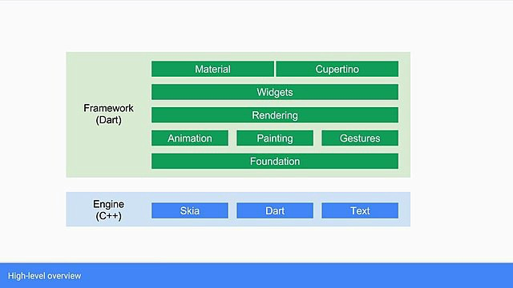
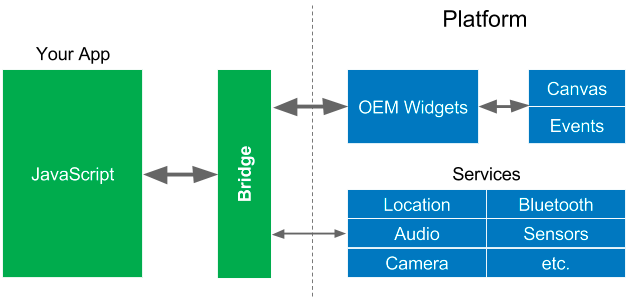
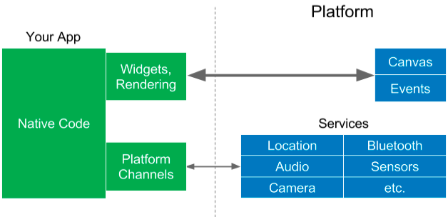

# What and Why is Flutter

## The Journey of Flutter

On the [Google I/O ’17](https://www.youtube.com/watch?v=w2TcYP8qiRI&source=post_page---------------------------) Google introduced us Flutter,  A fresh new open source framework for creating mobile applications. 

There are many Cross Platform Framework available out there but Flutter is stood out the. Flutter provide the flexibility to develop the Mobile application \(Android and IOS\) and it also flexible to develop web and Desktop applications 

According to Google promise

> Flutter makes it easy and fast to build beautiful mobile apps

## Why Flutter ?

Flutter is a **mobile SDK** that allows us to create **cross-platform mobile applications** \(so you can write one code and run the app both on Android and iOS\). You write code in [**Dart**](https://www.dartlang.org/?source=post_page---------------------------), a language developed by Google, which looks very familiar if you used Java before. Instead of XML files, you build **layout tree** like this:

### \#1 Hot reload

### \#2 Full set of \(Material Design\) widgets

### \#3 Everything is a Widget

### \#4 Different themes for Android/iOS

### \#5 Many, many, many packages

### \#6 Consistent 60 FPS \(frames per second\) performance

Flutter apps compile to Native code, so the performance is as good as it gets. In fact, I found it to be much more suitable for building a game like app than using Java/Swift. Because of its reactive nature, writing UI code is much cleaner. And that combined with the performance characteristics, probably makes it a good contender for building games as well.

This article by [@wmleler1](http://twitter.com/wmleler1?source=post_page---------------------------) \(developer advocate @ Google\) does a great job of explaining why Flutter’s rendering is crazy fast - [https://hackernoon.com/whats-revolutionary-about-flutter-946915b09514](https://hackernoon.com/whats-revolutionary-about-flutter-946915b09514?source=post_page---------------------------). I’ll just borrow from this article and post a few diagrams and quotes that present a TLDR version of it, comparing the three architectures - Native vs React Native vs Flutter.

**Native apps \(Java/Swift\)**

> Your app talks to the platform to create widgets, or access services like the camera. The widgets are rendered to a screen canvas, and events are passed back to the widgets. This is a simple architecture, but you pretty much have to create separate apps for each platform because the widgets are different, not to mention the native languages.

**React Native / Ionic apps \(Javascript\)**

> React Native ****and Ionic is very popular, but because the JavaScript realm accesses the OEM widgets in the native realm, it has to [go through the bridge](https://medium.com/@talkol/performance-limitations-of-react-native-and-how-to-overcome-them-947630d7f440?source=post_page---------------------------) for those as well. Widgets are typically accessed quite frequently \(up to 50-60 times a second during animations, transitions, or when the user “swipes” something on the screen with their finger\) so this can cause performance problems.
>
> Here lies one of the main keys to understanding React Native and Ionic performance. Each realm by itself is blazingly fast. The performance bottleneck often occurs when we move from one realm to the other. In order to architect performant React Native and Ionic apps, we must keep passes over the bridge to a minimum.

**Flutter apps \(Dart\)**

> Flutter takes a different approach to avoiding performance problems caused by the need for a JavaScript bridge by using a compiled programming language, namely [Dart](https://www.dartlang.org/?source=post_page---------------------------). Dart is compiled “ahead of time” \(AOT\) into native code for multiple platforms. This allows Flutter to communicate with the platform without going through a JavaScript bridge that does a context switch.
>
> Flutter has a new architecture that includes widgets that look and feel good, are fast, and are customisable and extensible. That’s right, **Flutter does not use the OEM widgets** \(or DOM WebViews\), **it provides its own widgets**.
>
> Flutter moves the widgets and the renderer from the platform into the app, which allows them to be customisable and extensible. All that Flutter requires of the platform is a canvas in which to render the widgets so they can appear on the device screen, and access to events \(touches, timers, etc.\) and services \(location, camera, etc.\).

### **\#**7 Release on both android and iOS like a boss.

### \#8 The Flutter Community

